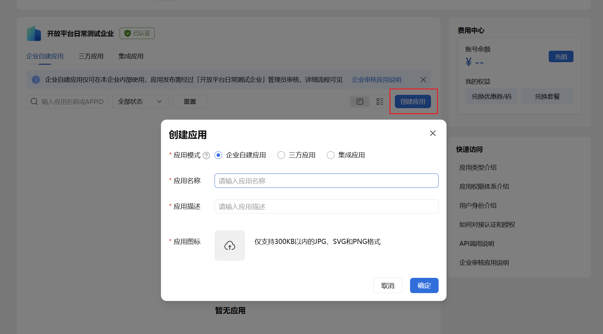
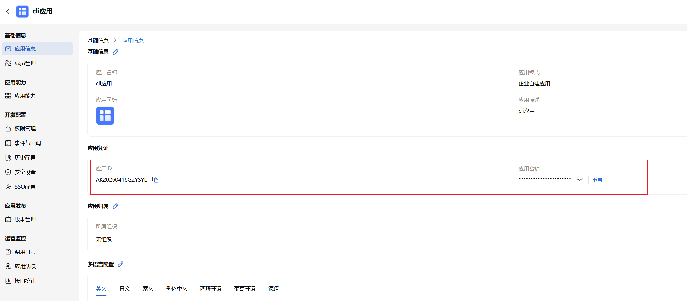
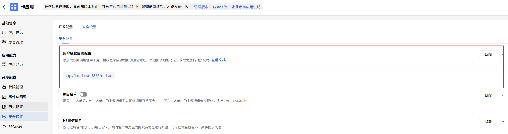
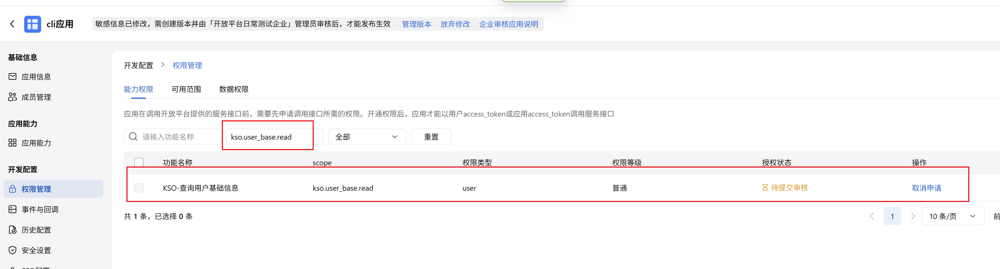
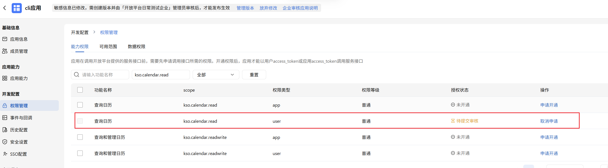
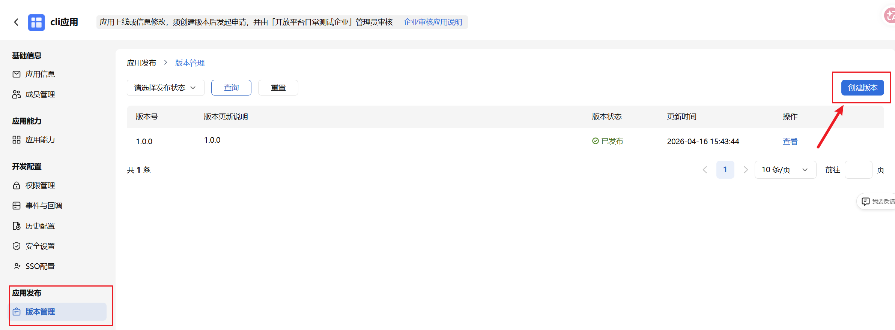
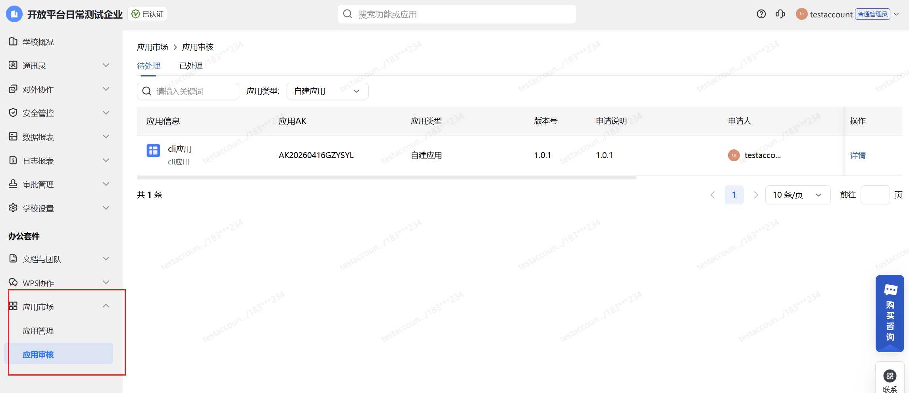
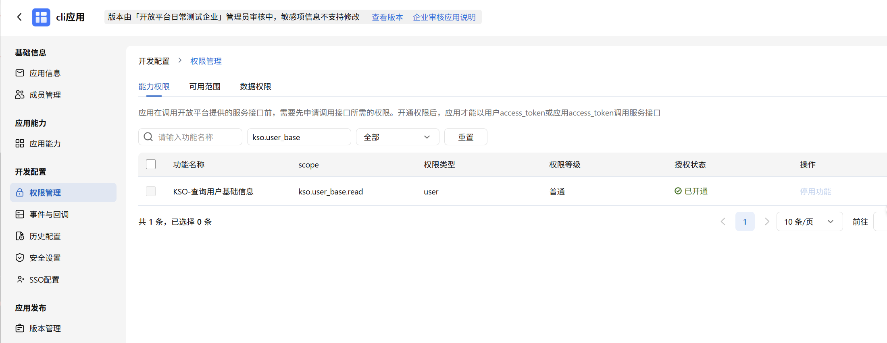

# 前置准备：创建应用与权限配置

使用 wps365-cli 之前，需要先在 WPS 365 开放平台完成应用创建、权限申请与企业审批。本文档将逐步引导你完成全部准备工作。

## 整体流程

```
创建应用 → 获取凭证 → 添加回调地址 → 申请权限并提交发布 → 企业管理员审批
```

---

## Step 1：创建企业自建应用

访问 [WPS 365 开放平台开发者后台](https://open.wps.cn/developer)，使用企业账号登录后，在「企业自建应用」标签页下点击 **创建应用**，选择「企业自建应用」模式，填写应用名称、描述和图标后确定即可。



---

## Step 2：记录应用 ID 和应用密钥

创建成功后，点击进入应用，查看 **基础信息 → 应用信息 → 应用凭证**：



分别记录以下两个值，后续配置 CLI 时需要用到：

| 平台显示 | CLI 对应 | 说明 |
|---------|---------|------|
| **应用 ID** | `APP ID (client_id)` | 点击右侧复制按钮即可复制 |
| **应用密钥** | `App Secret (client_secret)` | 默认隐藏，点击 ∨ 展开查看；点击「重置」可重新生成 |

> **安全提醒**：请妥善保管应用密钥，重置后旧密钥立即失效。

---

## Step 3：添加回调地址到开放平台

`wps365-cli auth login` 通过本地启动 HTTP 服务接收 OAuth 回调，需要在开放平台注册该回调地址。

进入应用详情页，点击左侧 **开发配置 → 安全设置**，在「用户授权回调配置」处点击「编辑」，添加以下回调地址：

```
http://localhost:18365/callback
```



> 如果不配置此回调地址，`wps365-cli auth login` 将无法完成用户授权流程。

---

## Step 4：申请权限并提交发布

### 4.1 申请 API 权限

进入应用详情页，点击左侧 **开发配置 → 权限管理**，在「能力权限」标签页中搜索需要的 scope，点击「申请开通」。以下以 `kso.user_base.read` 和 `kso.calendar.read` 两个 scope 为例：





申请后权限状态变为 **待提交审核**（橙色标记），需要通过下一步的版本发布提交审批。同一个 scope 可能同时有 `app`（应用身份）和 `user`（用户授权）两种权限类型，根据实际使用场景按需申请。

### 4.2 创建版本并提交发布

进入应用详情页，点击左侧 **应用发布 → 版本管理**，点击右上角 **创建版本**：



填写版本号（如 `1.0.0`）和版本更新说明后，点击 **申请发布**。

---

## Step 5：企业管理员审批

企业管理员登录 [WPS 365 企业管理后台](https://work.wps.cn)，进入 **应用市场 → 应用审核**：



在「待处理」列表中找到待审核的应用，点击「详情」确认权限范围后 **审批通过**。

> 如果你本人不是企业管理员，需要联系企业管理员在 `work.wps.cn` 完成审批。

审批通过后，权限状态变为 **已开通**（绿色标记），即刻生效：



至此前置准备全部完成，回到 [README](../README.md) 继续了解 CLI 的安装与使用方式。

---

## 常见问题

### Q：权限申请后为什么没有生效？

权限申请后需要完成「创建版本 → 申请发布 → 企业管理员审批」的完整流程才会生效。仅申请权限而不提交版本审批，权限会一直处于「待提交审核」状态。

### Q：通讯录接口返回空数据或权限错误？

部分 API（尤其是通讯录相关接口）除了需要「能力权限」外，还需要配置「可用范围」和「数据权限」。请在应用详情页的 **权限管理** 中检查。详细配置说明请参考官方文档：[开发应用](https://365.kdocs.cn/3rd/open/documents/app-integration-dev/guide/self-app/develop-app)。

### Q：CLIENT_SECRET 泄露了怎么办？

立即在开发者后台「应用凭证」区域点击「重置」生成新密钥，旧密钥立即失效。然后重新执行 `wps365-cli auth setup` 配置新凭证。

